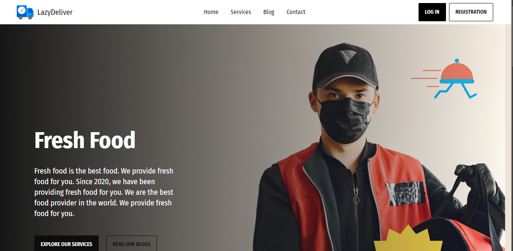
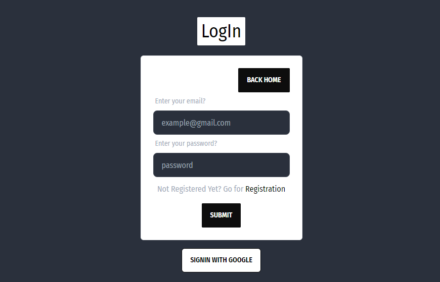
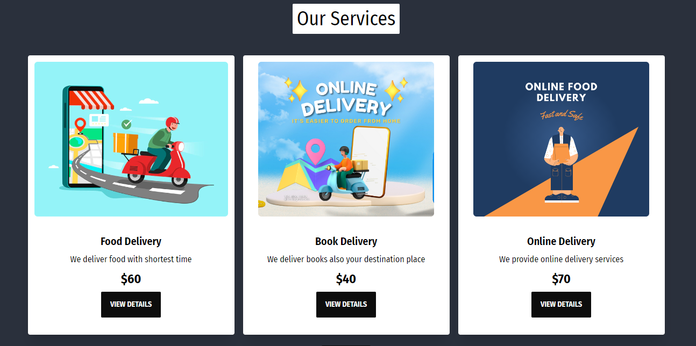
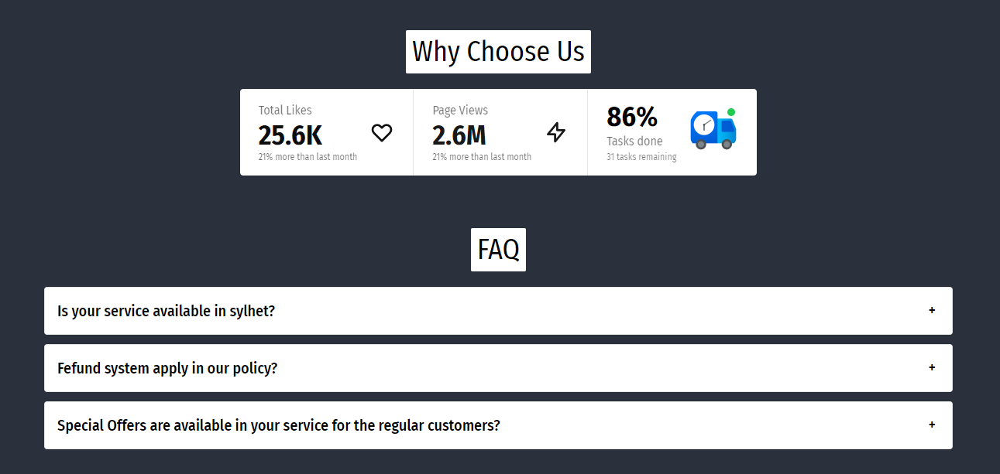
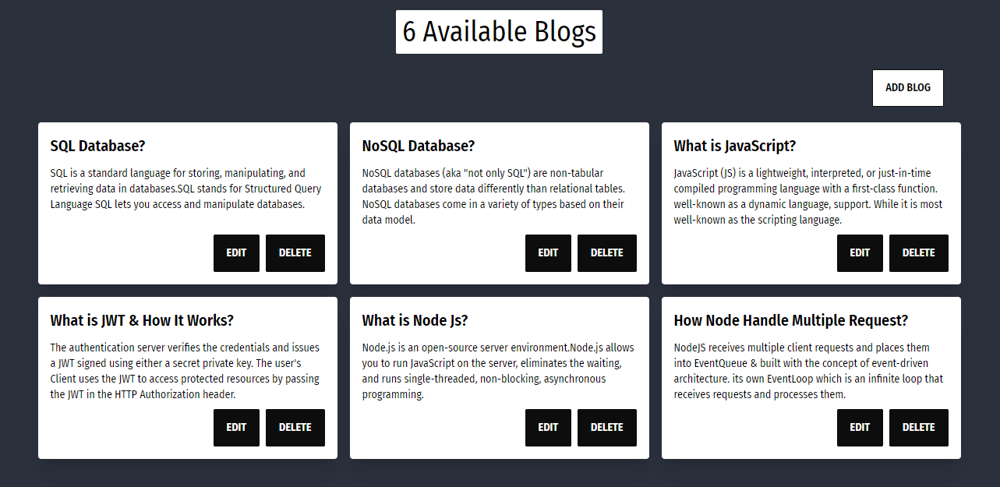

## LazyDeliver (FullStack)
LazyDeliver is a delivery service based full-stack website built with React.js, Node.js, Express, MongoDB, Firebase, TailwindCss, and DaisyUI. It is a full-stack website where users can order food from their favorite restaurants. Customer can add their review based on given service.

#### Deployed Site
- [Live Site](https://lazy-learn-366bc.web.app/)
- [Server Site](https://lazy-deliver-server.vercel.app/)

#### Used Technologies 
##### Backend

- Node.js
- Express.js
- Cors
- MongoDB

##### Frontend

- React
- React Router DOM
- Context API
- Firebase
- Tailwind CSS
- DaisyUI

#### Deployed Site
- Vercel (Server)
- Firebase (Client)

#### Screenshots

- Home Page
- 

- Login Page
- 

- Services
- 

- FAQ and Why Choose Us
- 

- Blog
- 

#### How to run this project

- Clone this repository
##### Frontend
- cd into the project directory `cd lazy-deliver-client`
- Run `npm install`
- Setup your firebase config
- Run `npm start`

##### Backend
- cd into the project directory `cd lazy-deliver-server`
- Run `npm install`
- Setup your MongoDB config
- Run `npm start`

